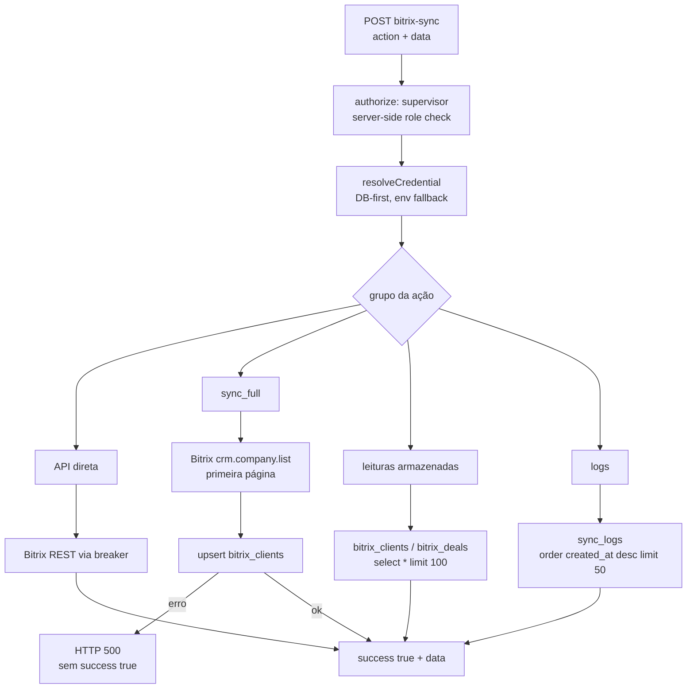

# ADR — contrato por ação do `bitrix-sync`

- **Data:** 2026-08-26
- **Estado:** falso verde corrigido e Edge Function implantada na versão 243; decisão de persistência continua pendente
- **Escopo:** etapas 41–42 do plano de estabilização
- **Fontes de evidência:** `supabase/functions/bitrix-sync/index.ts`, `tests/contracts/webhook-schemas.ts`, busca de consumidores locais e consulta somente leitura a `pg_catalog` no projeto canônico `doufsxqlfjyuvxuezpln`.

## Decisão pendente

> **Atualização de execução — 2026-08-28:** `sync_full` agora retorna HTTP 500
> e omite `success:true` quando o upsert falha. O teste handler-real exige tanto
> o caminho de falha explícita quanto o sucesso com persistência sintética. Não
> foram criadas tabelas, migrations ou alterações no banco. Após autorização do
> PO, a Edge Function foi implantada como versão 243, preservando
> `verify_jwt=true`; smoke remoto sem autenticação retornou 401 no gateway. Nenhum
> request Bitrix real foi executado.

`bitrix-sync` não é um único fluxo. Ele contém quatro contratos diferentes, dos quais apenas a API direta é operacionalmente independente de tabelas locais. A decisão proposta é **não promover nem alterar as ações persistidas** até o PO escolher uma fonte de verdade para o espelho local e autorizar explicitamente qualquer migration/DDL.

As ações persistidas continuam indisponíveis enquanto as tabelas não forem
aprovadas/existirem, mas essa indisponibilidade deixou de ser mascarada como
sucesso. A decisão de manter espelho local, operar só por API ou substituir o
adaptador permanece necessária antes de qualquer migration ou uso dos caminhos de espelho.



## Matriz de contrato observado

| Grupo | Ações | Efeito externo/local | Resultado atual | Estado |
|---|---|---|---|---|
| API direta, leitura | `get_companies`, `get_company`, `search_companies`, `get_deals`, `get_deal_products` | Chama Bitrix REST; não usa tabela local de espelho | Envelope `{ success: true, data }` quando Bitrix responde 2xx | Parcialmente verificável localmente; requer credencial/Bitrix para smoke real |
| API direta, mutação | `create_deal`, `update_deal` | Cria/altera deal remoto em Bitrix | Mesmo envelope; sem validação estruturada dos campos de negócio além de presença | Contrato externo ativo/desconhecido; não foi invocado nesta auditoria |
| Persistência | `sync_full` | Lê **somente a primeira página** de `crm.company.list`, depois faz upsert em `public.bitrix_clients` por `bitrix_id` | sucesso retorna `synced`; erro de upsert encerra com HTTP 500 e mensagem pública estável | Falso verde corrigido localmente; storage não existe no banco canônico |
| Leitura de espelho | `get_stored_clients`, `get_stored_deals` | `select('*').limit(100)` em `public.bitrix_clients` e `public.bitrix_deals` | Falha 500 se a tabela falhar/não existir | Parcial/inoperante no banco canônico atual |
| Logs | `get_sync_logs` | `select('*').order('created_at', desc).limit(50)` em `public.sync_logs` | Falha 500 se a tabela falhar/não existir | Parcial/inoperante; nome diverge da documentação histórica |

## Fonte de verdade e divergências

1. **Autorização e credencial.** Todas as ações exigem `supervisor` com checagem server-side; a URL de webhook é resolvida por `resolveCredential('BITRIX24_WEBHOOK_URL')`, que prioriza `integration_credentials` e só então o ambiente. Isso é o contrato atual do código.
2. **Persistência implementada.** Só `sync_full` persiste e somente em `bitrix_clients`. Não existe no handler escrita de deals nem de logs.
3. **Nome de logs divergente.** O código usa `sync_logs`; `docs/FUNCIONALIDADES_E_FERRAMENTAS.md` e migrations históricas descrevem `bitrix_sync_logs`. Nenhuma deve ser escolhida, criada, removida ou renomeada sem decisão explícita.
4. **Consumidores locais.** A busca no frontend não encontrou `supabase.functions.invoke('bitrix-sync')`; o fluxo de orçamento usa a Edge Function distinta `sync-quote-bitrix`. Isso não prova ausência de consumidores externos, por isso as ações diretas foram preservadas.

## Evidência do banco canônico (somente leitura)

Consulta realizada em 2026-08-26 contra `pg_catalog.pg_class`, `information_schema.columns` e `pg_catalog.pg_policies`, limitada a `public.bitrix_clients`, `public.bitrix_deals`, `public.bitrix_sync_logs` e `public.sync_logs`:

- não há relation em `public` para nenhum dos quatro nomes;
- consequentemente não há colunas nem policies a reconciliar para eles no estado vivo observado.

Isto explica por que `sync_full`, as leituras armazenadas e os logs não têm uma persistência executável no projeto canônico. Não é evidência para apagar migrations históricas: elas podem representar uma tentativa anterior, outro ambiente ou contratos de consumidores não vistos.

## Gaps comprovados

- `sync_full` não pagina e não sincroniza deals; a contagem `synced` é de empresas lidas, não de linhas efetivamente persistidas.
- Falha de upsert já não é mascarada na versão 243; falta validar o caminho autenticado em staging antes de liberar `sync_full` para uso.
- Os três caminhos de storage apontam para objetos ausentes no banco canônico.
- `get_company` e `get_deal_products` usam `0` quando o id não é numérico/ausente; o upstream recebe a chamada em vez de o handler retornar `400`.
- `create_deal`/`update_deal` aceitam records livres. Isso preserva a flexibilidade do Bitrix, mas impede validar localmente campos de domínio/idempotência.
- O import de `handleCorsPreflightIfNeeded` e a função local `parseColor` não são usados pelo handler. Foram preservados: remoção é limpeza, não correção do contrato.

## Teste de caracterização entregue

`supabase/functions/bitrix-sync/handler_characterization_test.ts` intercepta o `Deno.serve` real e usa apenas um `fetch` sintético local. Ele prova:

- os sete caminhos de API direta, seus endpoints e payloads Bitrix;
- que `sync_full` retorna 500, sem `success:true`, quando `bitrix_clients` retorna erro de schema;
- que o mesmo caminho retorna 200/`success:true` quando o upsert sintético funciona;
- limites e tabelas das leituras armazenadas;
- que logs consultam `sync_logs`, por `created_at desc`, limite 50.

Comando:

```bash
deno test --config supabase/functions/deno.json --allow-env --allow-net supabase/functions/bitrix-sync/handler_characterization_test.ts
```

## Próxima decisão necessária do PO

Escolher uma das alternativas antes de alterar comportamento:

1. **Manter espelho local.** Definir quais objetos são canônicos (`bitrix_clients`, `bitrix_deals`, e um único nome para logs), modelar retenção/RLS/FKs/índices e aprovar uma migration forward-only separada. Só depois alterar o handler para falhar explicitamente em persistência e testar sucesso/erro real.
2. **Operar somente por API direta.** Desativar/apagar `sync_full` e leituras armazenadas apenas após inventário de consumidores externos e validação explícita do PO. Não confundir isso com remoção de tabelas/migrations históricas.
3. **Substituir pelo CRM atual.** Especificar um adaptador e contrato de compatibilidade; não redirecionar silenciosamente as ações Bitrix para outro backend.

Até essa escolha, a recomendação é classificar as ações persistidas como **off/indisponíveis operacionalmente** em qualquer superfície nova e manter a API direta sem alteração de semântica.
